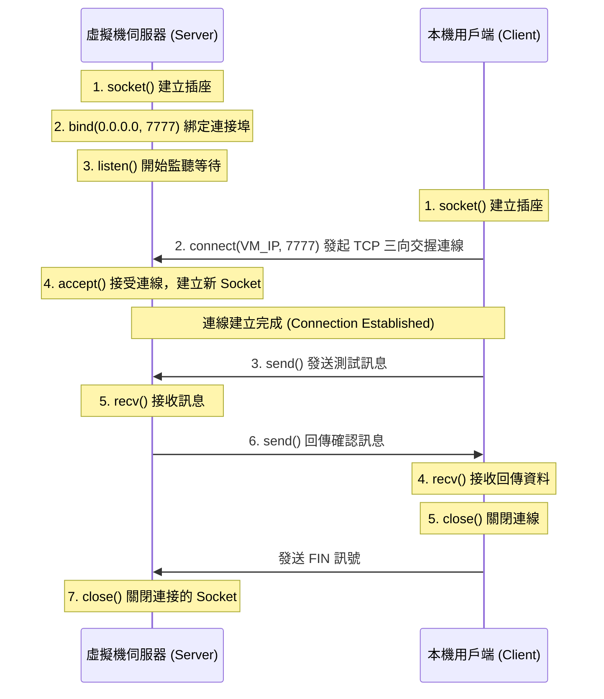

# VMware VM Socket Connection Guide

此專案用於建立及測試從**本機電腦（Host）**到**VMware虛擬機（Guest）**的 TCP Socket 連線。專案已將預設連接埠（Port）修改為 **`7777`**。

---

##  目錄
1. [專案結構](#1-專案結構)
2. [快速開始與連線測試](#2-快速開始與連線測試)
3. [VMware 網路配置與故障排除](#3-vmware-網路配置與故障排除)
4. [Socket 技術原理詳解](#4-socket-技術原理詳解)

---

## 1. 專案結構
* **[server.py](file:///Users/jesse/Documents/python/socket_server/server.py)**：Socket 伺服器端（Python 腳本）。**必須在 VMware 虛擬機內運行**。
* **[client.py](file:///Users/jesse/Documents/python/socket_server/client.py)**：Socket 用戶端（Python 腳本）。**在本機電腦運行**。
* **[server_notebook.ipynb](file:///Users/jesse/Documents/python/socket_server/server_notebook.ipynb)**：Jupyter Notebook 版本伺服器。採用多執行緒背景執行設計，避免鎖死 Jupyter 核心，**必須在虛擬機內運行**。
* **[client_notebook.ipynb](file:///Users/jesse/Documents/python/socket_server/client_notebook.ipynb)**：Jupyter Notebook 版本用戶端。**在本機電腦運行**。

---

## 2. 快速開始與連線測試

### 方案 A：使用 Python 腳本 (.py) 測試

#### 第一步：獲取虛擬機的 IP 位址
請在您虛擬機的作業系統終端機執行以下指令：
* **Linux / macOS**: `ip a` 或 `ifconfig`
* **Windows VM**: `ipconfig`

尋找對應的 IPv4 位址（例如：`192.168.123.4`）。

#### 第二步：在虛擬機上啟動伺服器 (Server)
1. 將 **[server.py](file:///Users/jesse/Documents/python/socket_server/server.py)** 複製到虛擬機中。
2. 執行：
   ```bash
   python3 server.py
   ```

#### 第三步：在本機電腦運行用戶端 (Client)
1. 在本機終端機執行：
   ```bash
   python3 client.py
   ```
2. 當提示輸入 IP 時，輸入虛擬機的 IP 位址即可開始連線測試。

---

### 方案 B：使用 Jupyter Notebook (.ipynb) 測試

#### 第一步：在虛擬機上啟動 Jupyter 伺服器
1. 將 **[server_notebook.ipynb](file:///Users/jesse/Documents/python/socket_server/server_notebook.ipynb)** 複製到虛擬機中。
2. 在虛擬機中開啟並執行該 Notebook 的第一個 Cell。它會在背景開啟一個執行緒以監聽 Port `7777`（您的 Jupyter 核心不會被鎖死，仍然可以執行其他指令）。

#### 第二步：在本機電腦運行 Jupyter 用戶端
1. 在本機打開 **[client_notebook.ipynb](file:///Users/jesse/Documents/python/socket_server/client_notebook.ipynb)**。
2. 修改第一個 Cell 中的 `VM_IP = "192.168.123.4"` 為您虛擬機的實際 IP 位址。
3. 執行該 Cell 即可看到連線成功的回應。

#### 第三步：關閉背景伺服器
1. 在虛擬機的 `server_notebook.ipynb` 中，執行最後一個 Cell 即可安全停止背景執行緒，釋放 Port 資源。

---

## 3. VMware 網路配置與故障排除

若本機無法連上虛擬機，多數是虛擬化網路卡模式或防火牆的問題。

### 網路模式選擇
1. **NAT 模式（推薦）**：
   * 虛擬機與本機處在 VMware 建立的虛擬私有網路中（例如本機是 `192.168.123.1`，VM 是 `192.168.123.4`）。
   * 本機與虛擬機通常可以直接透過這個 IP 互相連線。
2. **Bridged（橋接）模式**：
   * 虛擬機直接向您實體的路由器獲取 IP，等同於您區網內的一台獨立實體電腦。
   * 本機與虛擬機必須連上同一個 Wi-Fi 或路由器才可互相通訊。

### 常見阻礙：防火牆
* **Linux 虛擬機**：若開啟了防火牆，會擋下外來連線。請在虛擬機放行 `7777` 連接埠：
  ```bash
  sudo ufw allow 7777/tcp
  ```
* **Windows 虛擬機**：需要在「具有進階安全性的 Windows Defender 防火牆」中，新增「輸入規則」（Inbound Rule），允許 TCP 7777 連接埠通過。

---

## 4. Socket 技術原理詳解

### 什麼是 Socket（通訊端點）？
Socket（中文常譯為「通訊端」或「套接字」）是作業系統提供給應用程式進行**網路雙向通訊**的抽象介面（API）。
您可以將它想像成一個**插座**。當本機與虛擬機要進行通訊時，兩邊都需要接上「插座」，並拉一條「網路線」（TCP 連線）將兩者接通。

一個 Socket 的唯一識別由以下兩者決定：
$$\text{Socket} = \text{IP Address} + \text{Port}$$
* **IP Address**：定位網路上的特定主機（例如虛擬機的 `192.168.123.4`）。
* **Port（連接埠）**：定位該主機上的特定應用程式（例如我們設定的 `7777`，用來識別這台機器上的 Socket 伺服器程式）。

---

### TCP 連線運作生命週期 (Socket Lifecycle)

本專案使用的是 **TCP (Transmission Control Protocol, 傳輸控制協定)**，它是一種**導向連線的、可靠的**傳輸通訊協定。

以下是 TCP Socket 在伺服器（Server）與用戶端（Client）之間的完整生命週期流程圖：



### 重點 API 作用說明（以 Python 代碼為例）

1. **`socket.socket(socket.AF_INET, socket.SOCK_STREAM)`**
   * `AF_INET`：代表使用 IPv4 位址協議。
   * `SOCK_STREAM`：代表使用可靠的 **TCP 流式傳輸**（若是 UDP 則使用 `SOCK_DGRAM`）。

2. **`setsockopt(socket.SOL_SOCKET, socket.SO_REUSEADDR, 1)`**
   * 允許伺服器關閉後立即重新使用 `7777` 連接埠。否則作業系統會將該埠口鎖定（TIME_WAIT 狀態）約 1~2 分鐘，導致重新運行程式時噴出 `Address already in use` 錯誤。

3. **`bind((host, port))`**
   * 伺服器端呼叫，將 Socket 綁定至特定的 IP 與連接埠。
   * 本專案綁定 `0.0.0.0`，代表「監聽該 VM 上所有網路卡的 IP」。

4. **`listen(backlog)`**
   * 伺服器端呼叫，進入被動監聽狀態。`backlog`（設為 5）代表最多允許 5 個用戶端在佇列中排隊等待連線處理。

5. **`accept()`**
   * 伺服器端呼叫，此步驟是**阻塞（Blocking）**的。程式會在此暫停，直到有用戶端連線進來。
   * 連線成功後，`accept()` 會回傳一個**全新的 Socket 物件**（專門用來與該用戶端一對一通訊）以及用戶端的 IP/Port。

6. **`connect((ip, port))`**
   * 用戶端呼叫，向伺服器發起連線。這會觸發 TCP 的「三向交握」（Three-Way Handshake）來確保雙方的收發能力正常。

7. **`sendall(data)` / `recv(buffer_size)`**
   * 雙方進行資料收發。TCP 是流式協議，資料會以位元組流（Bytes）形式傳輸，因此在 Python 中我們使用 `.encode('utf-8')` 將字串轉為位元組發送，收到後用 `.decode('utf-8')` 還原。

8. **`close()`**
   * 釋放網路資源，關閉通訊端。這會觸發 TCP 「四次揮手」（Four-Way Wavehand）來優雅地斷開連線。
# socket_server
